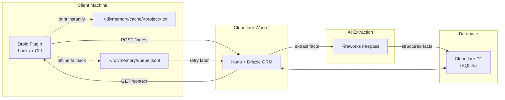

# divmemory — Persistent cross-session memory for coding agents

`divmemory` is a Droid plugin + Cloudflare Workers backend that gives your coding agents a persistent second brain. At session end, the full conversation is extracted into structured memory facts and stored in Cloudflare D1. At session start, cached memory is injected directly into the agent context while fresh context syncs for the next run. Zero repo file editing, zero git noise.

## Architecture



**Hook flow**: SessionEnd → extract conversation → POST to Worker → Firepass fact extraction → D1 storage. If the Worker is offline, the hook writes to `~/.divmemory/queue.jsonl` and retries later. SessionStart → print `~/.divmemory/cache/<project>.txt` when present → refresh cache from `GET /context`.

**Memory topics**: `project_context`, `decisions`, `issues`, `preferences`, `general`.

## Setup

This section is written for self-hosting: your own Cloudflare Worker, your own D1 database, your own Fireworks key, and a Droid/Factory plugin install that can be repeated on each laptop.

### Prerequisites

- [Bun](https://bun.sh) ≥ 1.3
- [Wrangler](https://developers.cloudflare.com/workers/wrangler/) (installed through this repo or via `npx wrangler`)
- Node.js 20+ for Droid hook scripts
- Cloudflare account with D1 enabled
- Fireworks AI account with Firepass subscription
- Droid/Factory CLI with plugin support

### Install

```bash
git clone https://github.com/divkix/divmemory.git
cd divmemory
bun install
```

### Choose an API key

`DIVMEMORY_API_KEY` is your private bearer token for the Worker API. Generate a long random value and use the same value in the Worker secret and on every laptop that should write/read your memory.

```bash
openssl rand -hex 32
```

### Environment variables

| Variable | Where | Purpose |
|---|---|---|
| `DIVMEMORY_API_KEY` | Worker secret + shell / Droid env | Auth token for Worker API |
| `DIVMEMORY_WORKER_URL` | Shell / Droid env | Your deployed Worker URL |
| `FIREWORKS_API_KEY` | Worker secret | Firepass auth |
| `FIREWORKS_MODEL` | Worker env (optional) | Model string (default: `accounts/fireworks/routers/kimi-k2p6-turbo`) |
| `DIVMEMORY_WEB_PASSWORD` | Worker secret | Password for web UI login |
| `DIVMEMORY_HOME` | Shell / Droid env (optional) | Local cache/queue directory, defaults to `~/.divmemory` |

Set Worker secrets:

```bash
cd worker
npx wrangler secret put DIVMEMORY_API_KEY
npx wrangler secret put FIREWORKS_API_KEY
npx wrangler secret put DIVMEMORY_WEB_PASSWORD
```

### Local development

```bash
# Create local D1 database
cd worker
npx wrangler d1 create divmemory-db
```

Wrangler prints a `database_id`. Put that value into `worker/wrangler.jsonc` under the `d1_databases` array:

```jsonc
{
  "d1_databases": [
    {
      "binding": "DB",
      "database_name": "divmemory-db",
      "database_id": "<your-d1-database-id>"
    }
  ]
}
```

Then apply migrations and run the local Worker:

```bash
# Apply migrations (uses worker/migrations/ via migrations_dir in wrangler.jsonc)
npx wrangler d1 migrations apply divmemory-db --local

# (Optional for local, required for deployment) Create the Cloudflare queues:
npx wrangler queues create divmemory-ingest
npx wrangler queues create divmemory-ingest-dlq

# Start the worker
bun run dev    # runs `wrangler dev --port 8787`
```

For local testing, set:

```bash
export DIVMEMORY_API_KEY="<same token used by the Worker>"
export DIVMEMORY_WORKER_URL="http://127.0.0.1:8787"
```

### Plugin installation in Droid

1. Add the repo as a marketplace: `droid plugin marketplace add https://github.com/divkix/divmemory`
2. Install the plugin: `droid plugin install divmemory@divmemory --scope user`
3. Set `DIVMEMORY_API_KEY` and `DIVMEMORY_WORKER_URL` in your shell profile or Droid env

Example shell profile setup:

```bash
export DIVMEMORY_API_KEY="<your token>"
export DIVMEMORY_WORKER_URL="https://<your-worker>.<your-subdomain>.workers.dev"
```

Install the same plugin and env vars on each laptop. Projects with a git remote share memory through the normalized remote URL. Local-only folders use a hashed absolute path slug, so two unrelated folders named `my-app` do not collide.

The Factory-visible plugin lives at `plugins/divmemory/` with `.factory-plugin/plugin.json`, `hooks/hooks.json`, commands, skills, and self-contained hook runtime files.

### First-run smoke test

After the Worker is running and your env vars are set, these checks confirm the main path works:

```bash
# Worker health/status
curl -H "Authorization: Bearer $DIVMEMORY_API_KEY" \
  "$DIVMEMORY_WORKER_URL/status"

# Add a curated fact manually
curl -X POST "$DIVMEMORY_WORKER_URL/memories" \
  -H "Authorization: Bearer $DIVMEMORY_API_KEY" \
  -H "Content-Type: application/json" \
  -d '{"project_id":"manual-smoke","topic":"preferences","content":"Prefer concise implementation notes for this project."}'

# Read injected context
curl -H "Authorization: Bearer $DIVMEMORY_API_KEY" \
  "$DIVMEMORY_WORKER_URL/context?project=manual-smoke"
```

The web UI is available at your Worker root URL. Log in with `DIVMEMORY_WEB_PASSWORD`.

### Cache and offline queue

The Droid hooks keep local state under `~/.divmemory` by default:

```text
~/.divmemory/
├── cache/        # Last fetched context per project, printed instantly on SessionStart
└── queue.jsonl   # SessionEnd payloads waiting for retry when the Worker is offline
```

SessionStart never blocks on a successful network fetch before printing usable context: it prints cached context when present, then refreshes the cache. SessionEnd exits cleanly even when offline: it appends the ingest payload to `queue.jsonl`, then retries queued entries during the next SessionEnd.

## Project structure

```
divmemory/
├── worker/                  # CF Worker (Hono + Drizzle)
│   ├── src/
│   │   ├── index.ts         # Hono router + middleware
│   │   ├── auth.ts          # API key + cookie auth
│   │   ├── login.ts         # Web UI login endpoint
│   │   ├── csrf.ts          # CSRF protection
│   │   ├── schema.ts        # Drizzle D1 schema
│   │   └── routes/
│   │       ├── ingest.ts    # POST /ingest — receive + extract
│   │       ├── context.ts   # GET /context — formatted memory
│   │       ├── consolidate.ts # POST /consolidate
│   │       ├── memories.ts  # GET/PATCH/DELETE /memories
│   │       └── webui.tsx    # Hono JSX web UI
│   ├── wrangler.jsonc
│   └── vitest.config.ts
├── plugins/divmemory/       # Factory marketplace plugin for public install
│   ├── .factory-plugin/
│   │   └── plugin.json
│   ├── hooks/
│   │   ├── hooks.json
│   │   ├── runtime.mjs
│   │   ├── session-end.mjs
│   │   └── session-start.mjs
│   ├── commands/
│   │   └── memory.md
│   └── skills/
│       └── memory/SKILL.md
├── plugin/                  # Workspace test harness for hook/script contracts
│   ├── plugin.json          # Plugin manifest
│   ├── hooks.json           # Hook configuration
│   ├── scripts/
│   │   ├── session-end.mjs  # SessionEnd hook script
│   │   └── session-start.mjs # SessionStart hook script
│   ├── commands/
│   │   └── memory.md        # /memory slash command
│   └── skills/
│       └── memory/SKILL.md  # Agent skill definition
├── cli/                     # Bootstrap CLI (npm: divmemory-bootstrap)
│   └── src/
│       ├── index.ts         # Entry point
│       └── cli.ts           # CLI logic + batch import
├── specs/
│   └── initial.md           # Full project specification
└── package.json             # Bun workspaces root
```

## Scripts

| Command | Description |
|---|---|
| `bun install` | Install all workspace dependencies |
| `bun run dev` | Start Worker locally (`wrangler dev --port 8787`) |
| `bun test` | Run all tests (Vitest) |
| `bun run typecheck` | Type-check all packages (`tsc --noEmit`) |
| `bun run lint` | Lint all packages (`biome check .`) |
| `bun run format` | Auto-fix lint issues (`biome check --write .`) |
| `bun run build` | Build all packages |

Worker-specific (run from `worker/`):

| Command | Description |
|---|---|
| `bun run deploy` | Deploy Worker (`wrangler deploy`) |
| `bun run dev` | Local dev server on port 8787 |

## Testing

All tests use [Vitest](https://vitest.dev). Run from the repo root:

```bash
bun test            # Run all tests
bun test --watch    # Watch mode
```

Tests cover:

- **Worker routes**: ingest, context, consolidate, memories, web UI — mocked Firepass, in-memory D1
- **Plugin hooks**: SessionEnd conversation extraction, SessionStart context injection
- **CLI**: JSONL parsing, batch logic, error handling
- **Auth**: API key, cookie, CSRF
- **Schema**: Drizzle models, constraints, indexes

## Worker API

| Method | Path | Auth | Description |
|---|---|---|---|
| `POST` | `/ingest` | Bearer | Submit session transcript for extraction |
| `GET` | `/context?project=<id>` | Bearer | Get formatted memory block for project |
| `POST` | `/consolidate` | Bearer | Trigger consolidation pass |
| `GET` | `/memories?project=<id>` | Bearer/Cookie | List memories (JSON) |
| `POST` | `/memories` | Bearer/Cookie | Add curated manual memory |
| `PATCH` | `/memories/:id` | Bearer/Cookie | Edit a memory entry |
| `DELETE` | `/memories/:id` | Bearer/Cookie | Delete/archive a memory |
| `GET` | `/status?project=<id>` | Bearer | Get backlog, error, and memory counts |
| `GET` | `/` | Cookie | Web UI (Hono JSX) |
| `POST` | `/login` | — | Web UI login (sets cookie) |

### API examples

Submit a session transcript:

```bash
curl -X POST "$DIVMEMORY_WORKER_URL/ingest" \
  -H "Authorization: Bearer $DIVMEMORY_API_KEY" \
  -H "Content-Type: application/json" \
  -d '{
    "session_id": "manual-session-1",
    "project_id": "github.com/divkix/divmemory",
    "project_name": "divmemory",
    "source": "manual",
    "conversation": "User: We prefer Cloudflare D1 for this project.\n\nAssistant: Noted."
  }'
```

`/ingest` returns `status: "queued"` when extraction is running through `ctx.waitUntil`, `status: "processed"` when processed synchronously in tests/local fallbacks, and `status: "duplicate"` for an already-seen `session_id`.

Add a curated memory without waiting for extraction:

```bash
curl -X POST "$DIVMEMORY_WORKER_URL/memories" \
  -H "Authorization: Bearer $DIVMEMORY_API_KEY" \
  -H "Content-Type: application/json" \
  -d '{
    "project_id": "github.com/divkix/divmemory",
    "topic": "decisions",
    "content": "Curated facts should not be automatically archived."
  }'
```

Check project health:

```bash
curl -H "Authorization: Bearer $DIVMEMORY_API_KEY" \
  "$DIVMEMORY_WORKER_URL/status?project=github.com/divkix/divmemory"
```

## Deployment

This project deploys to **Cloudflare Workers** with a **D1 SQLite database**. The daily cron job (3am UTC memory consolidation) is already declared in [`worker/wrangler.jsonc`](./worker/wrangler.jsonc) and deploys automatically with the Worker.

### Prerequisites

- **Cloudflare account** with Workers and D1 enabled (free tier is sufficient)
- **Bun** >= 1.3 (`curl -fsSL https://bun.sh/install | bash`)
- **Wrangler CLI** — installed via this repo's dependencies, or globally via `npm install -g wrangler`
- Logged in to Wrangler: `npx wrangler login`

### 1. Clone and install

```bash
git clone https://github.com/divkix/divmemory.git
cd divmemory
bun install
```

### 2. Create the D1 database

```bash
cd worker
npx wrangler d1 create divmemory-db
```

Wrangler prints a `database_id` (UUID). **Copy that value** and paste it into `worker/wrangler.jsonc`, replacing the placeholder `database_id`:

```jsonc
{
  "d1_databases": [
    {
      "binding": "DB",
      "database_name": "divmemory-db",
      "database_id": "<paste-your-uuid-here>"
    }
  ]
}
```

> **Why this step matters:** The checked-in `database_id` is a placeholder. You must use the real ID of the database in your Cloudflare account, otherwise the Worker cannot connect to D1 after deployment.

### 3. Apply database migrations

D1 does not run migrations automatically. From `worker/`, apply pending migrations with Wrangler (reads `migrations_dir` in `wrangler.jsonc`):

```bash
cd worker
npx wrangler d1 migrations apply divmemory-db --remote
```

Prefer `d1 migrations apply` over `d1 execute --file=...` per migration file. The apply command tracks which migrations ran and only runs unapplied files; manual `--file` execution bypasses that workflow and can cause duplicate runs or drift.

> **Tip:** To see what is pending or already applied, run `npx wrangler d1 migrations list divmemory-db --remote`.

### 4. Set Worker secrets

These values are encrypted and stored in Cloudflare's edge:

```bash
cd worker

# Auth token for the Worker API (used by plugin + CLI)
npx wrangler secret put DIVMEMORY_API_KEY

# Fireworks AI key for Firepass fact extraction
npx wrangler secret put FIREWORKS_API_KEY

# Password for the web UI login page
npx wrangler secret put DIVMEMORY_WEB_PASSWORD
```

| Secret | Required | What to enter when prompted |
|---|---|---|
| `DIVMEMORY_API_KEY` | **Yes** | A long random string. Generate with `openssl rand -hex 32`. Use the same value on every laptop running the Droid plugin. |
| `FIREWORKS_API_KEY` | **Yes** | Your [Fireworks AI](https://fireworks.ai) API key. A Firepass subscription is required for extraction. |
| `DIVMEMORY_WEB_PASSWORD` | **Yes** | Any password you want for the web UI. |

### 5. Deploy the Worker

```bash
cd worker
bun run deploy
```

Wrangler will bundle, upload, and print the live Worker URL, for example:

```
https://divmemory.<your-subdomain>.workers.dev
```

### 6. Configure the Droid plugin

On every machine that should read/write memory, export these environment variables (add to your shell profile):

```bash
export DIVMEMORY_API_KEY="<same token you set in Step 4>"
export DIVMEMORY_WORKER_URL="https://divmemory.<your-subdomain>.workers.dev"
```

Then install the plugin (run once per machine):

```bash
droid plugin marketplace add https://github.com/divkix/divmemory
droid plugin install divmemory@divmemory --scope user
```

### First-deploy smoke test

After Steps 1-5, verify the stack end-to-end:

```bash
export DIVMEMORY_API_KEY="<your token>"
export DIVMEMORY_WORKER_URL="https://divmemory.<your-subdomain>.workers.dev"

# 1. Worker health
curl -H "Authorization: Bearer $DIVMEMORY_API_KEY" \
  "$DIVMEMORY_WORKER_URL/status"

# 2. Add a manual memory
curl -X POST "$DIVMEMORY_WORKER_URL/memories" \
  -H "Authorization: Bearer $DIVMEMORY_API_KEY" \
  -H "Content-Type: application/json" \
  -d '{"project_id":"smoke-test","topic":"preferences","content":"Smoke test passed."}'

# 3. Read it back as formatted context
curl -H "Authorization: Bearer $DIVMEMORY_API_KEY" \
  "$DIVMEMORY_WORKER_URL/context?project=smoke-test"
```

If all three return JSON (not 401/500), your deployment is live. Open the root URL in a browser and log in with `DIVMEMORY_WEB_PASSWORD` to view the web UI.

### Updating a live deployment

Pull the latest code, reinstall, and redeploy:

```bash
git pull
bun install
cd worker
bun run deploy
```

If new SQL migrations were added, apply pending migrations before redeploying:

```bash
cd worker
npx wrangler d1 migrations apply divmemory-db --remote
bun run deploy
```

### Backup and recovery

Before risky changes, export your D1 data:

```bash
cd worker
npx wrangler d1 export divmemory-db --remote --output=divmemory-backup.sql
```

Store the `.sql` file outside the repo. The local `~/.divmemory/cache` and `queue.jsonl` files are convenience state only — **D1 is the source of truth**.

### Troubleshooting

| Symptom | Cause | Fix |
|---|---|---|
| `500` on first request | D1 not connected | Double-check `database_id` in `wrangler.jsonc` matches your real database. |
| `401 Unauthorized` | Wrong `DIVMEMORY_API_KEY` | Verify the secret in Wrangler matches your shell env var. Secrets are case-sensitive. |
| Migrations fail | SQL already applied | Skip files already run. Check `migrations/meta/` for a journal of applied migrations. |
| Worker deploy hangs | Not logged in | Run `npx wrangler login` and try again. |
| Firepass extraction fails | Missing or invalid `FIREWORKS_API_KEY` | Verify the key is active and has Firepass quota. CheckWorker logs via `npx wrangler tail`. |

## Bootstrap CLI

Import past sessions in bulk:

```bash
DIVMEMORY_API_KEY="<your token>" \
DIVMEMORY_WORKER_URL="https://<your-worker>.<your-subdomain>.workers.dev" \
npx divmemory-bootstrap --dir ~/.factory --limit 50
```

Finds session JSONL files, extracts conversations, and POSTs them to the Worker for processing.

Project IDs come from `git remote get-url origin` when available. Local-only folders use a hashed absolute-path slug such as `local-3f91ab4c2d10-my-app`, preventing collisions between different folders with the same basename.

## Tech stack

- **Runtime**: [Cloudflare Workers](https://workers.cloudflare.com)
- **Framework**: [Hono](https://hono.dev) (router, JSX, middleware)
- **ORM**: [Drizzle](https://orm.drizzle.team) (D1 SQLite)
- **Database**: [Cloudflare D1](https://developers.cloudflare.com/d1)
- **Extraction**: [Fireworks Firepass](https://fireworks.ai) (Kimi K2.6 Turbo)
- **Validation**: [Zod](https://zod.dev)
- **Runtime**: [Bun](https://bun.sh) (package management, test runner)
- **Testing**: [Vitest](https://vitest.dev)
- **Lint/Format**: [Biome](https://biomejs.dev)
- **Language**: TypeScript (strict mode)
