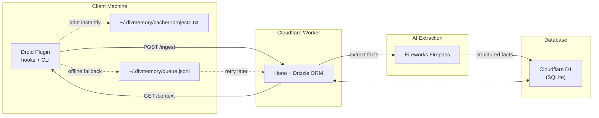

# divmemory — Persistent cross-session memory for coding agents

`divmemory` is a Droid plugin + Cloudflare Workers backend that gives your coding agents a persistent second brain. At session end, the full conversation is extracted into structured memory facts and stored in Cloudflare D1. At session start, cached memory is injected directly into the agent context while fresh context syncs for the next run. Zero repo file editing, zero git noise.

Full docs: https://divmemory-docs.divkix.workers.dev

## Architecture



SessionEnd extracts the conversation, POSTs it to the Worker, and Firepass turns it into structured facts stored in D1. If the Worker is offline, the payload is queued locally and retried later. SessionStart prints cached context instantly, then refreshes it from the Worker.

**Topics**: `project_context`, `decisions`, `issues`, `preferences`, `general`.

## Quickstart

```bash
# 1. Clone and install
git clone https://github.com/divkix/divmemory.git && cd divmemory && bun install

# 2. Generate a bearer token
openssl rand -hex 32

# 3. Deploy the Worker (see full docs for D1 + queues + secrets)
cd worker && bun run deploy
```

Configure your shell:

```bash
export DIVMEMORY_API_KEY="<same token>"
export DIVMEMORY_WORKER_URL="https://<your-worker>.<your-subdomain>.workers.dev"
```

Install the Droid plugin:

```bash
droid plugin marketplace add https://github.com/divkix/divmemory
droid plugin install divmemory@divmemory --scope user
```

## Smoke test

```bash
curl -H "Authorization: Bearer $DIVMEMORY_API_KEY" "$DIVMEMORY_WORKER_URL/status"

curl -X POST "$DIVMEMORY_WORKER_URL/memories" \
	-H "Authorization: Bearer $DIVMEMORY_API_KEY" \
	-H "Content-Type: application/json" \
	-d '{"project_id":"smoke-test","topic":"preferences","content":"Smoke test passed."}'

curl -H "Authorization: Bearer $DIVMEMORY_API_KEY" \
	"$DIVMEMORY_WORKER_URL/context?project=smoke-test"
```

## Scripts

| Command | Description |
| --- | --- |
| `bun install` | Install all workspace dependencies |
| `bun run dev` | Start Worker locally (`wrangler dev --port 8787`) |
| `bun test` | Run all tests (Vitest) |
| `bun run typecheck` | Type-check all packages (`tsc --noEmit`) |
| `bun run lint` | Lint all packages (`biome check .`) |
| `bun run format` | Auto-fix lint issues (`biome check --write .`) |
| `bun run build` | Build all packages |

## Tech stack

- **Runtime**: [Cloudflare Workers](https://workers.cloudflare.com)
- **Framework**: [Hono](https://hono.dev)
- **ORM**: [Drizzle](https://orm.drizzle.team) (D1 SQLite)
- **Database**: [Cloudflare D1](https://developers.cloudflare.com/d1)
- **Extraction**: [Fireworks Firepass](https://fireworks.ai)
- **Validation**: [Zod](https://zod.dev)
- **Runtime**: [Bun](https://bun.sh)
- **Testing**: [Vitest](https://vitest.dev)
- **Lint/Format**: [Biome](https://biomejs.dev)
- **Docs**: [Astro Starlight](https://starlight.astro.build)
