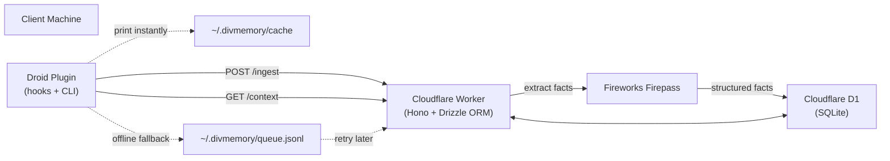

divmemory is a Droid plugin + Cloudflare Workers backend that gives your coding agents a persistent second brain.

At session end, the full conversation is extracted into structured memory facts and stored in Cloudflare D1. At session start, cached memory is injected directly into the agent context while fresh context syncs for the next run.

Zero repo file editing. Zero git noise.

## Architecture

## Memory topics

Facts are grouped by topic:

| Topic | What it captures |
| --- | --- |
| `project_context` | Domain language, patterns, libraries, project-specific rules |
| `decisions` | Architectural or tooling decisions with rationale |
| `issues` | Known bugs, edge cases, things to watch out for |
| `preferences` | Personal developer preferences that apply globally |
| `general` | Anything useful that does not fit the above |

Cross-project developer preferences flow through the reserved `global` project and are included with every project's context.
